# 校园学业规划助手 技术规格说明书（SPEC）

> **产品代号：GuardGPA**　|　对外传播名：「防挂科神器」

| 项目 | 内容 |
|------|------|
| 文档版本 | V1.0 |
| 文档状态 | 待评审 |
| 编写日期 | 2026-07-07 |
| 编写人 | 项目组 |
| 密级 | 内部 |

---

## 目录

- [一、文档概述](#一文档概述)
- [二、架构设计](#二架构设计)
- [三、技术栈选择](#三技术栈选择)
- [四、模块划分与职责](#四模块划分与职责)
- [五、对话管理层设计](#五对话管理层设计)
- [六、API 接口定义](#六api-接口定义)
- [七、数据模型设计](#七数据模型设计)
- [八、核心业务逻辑](#八核心业务逻辑)
- [九、LLM 集成方案](#九llm-集成方案)
- [十、定时任务与推送机制](#十定时任务与推送机制)
- [十一、部署与运维](#十一部署与运维)
- [十二、测试策略](#十二测试策略)

---

## 一、文档概述

### 1.1 文档目的

本文档为「校园学业规划助手」（GuardGPA）的技术规格说明，基于 PRD 文档编写，用于指导技术研发、接口联调、测试验收。文档定义系统架构、模块划分、API 契约、数据模型及核心业务逻辑。

### 1.2 参考文档

| 文档名称 | 版本 | 说明 |
|---------|------|------|
| 校园学业规划助手_PRD_V1.0.md | V1.0 | 产品需求文档 |

### 1.3 术语表

| 术语 | 说明 |
|------|------|
| LLM | 大语言模型，复习计划生成核心引擎 |
| DDL | Deadline，截止时间 |
| D-N | 距离考试 N 天 |
| Tool A/B/C/D/E | 五类功能工具（课表/死线/计划/进度/复盘） |
| OCR | 光学字符识别，课表截图解析 |

---

## 二、架构设计

### 2.1 整体架构

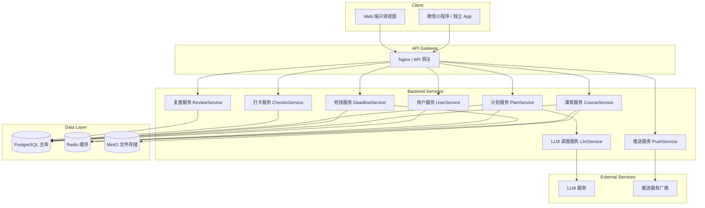

### 2.2 分层说明

| 层级 | 职责 | 说明 |
|------|------|------|
| 客户端 | 用户交互、页面渲染、本地缓存 | 微信小程序为主，支持 Web 只读视图 |
| 网关层 | 请求路由、限流、鉴权、日志 | 统一入口，支持水平扩展 |
| 服务层 | 业务逻辑处理、工具编排、LLM 调用 | 微服务架构，独立部署 |
| 数据层 | 数据持久化、缓存、文件存储 | PostgreSQL + Redis + MinIO |
| 外部服务 | LLM 推理、消息推送 | 第三方服务集成 |

### 2.3 核心闭环流程

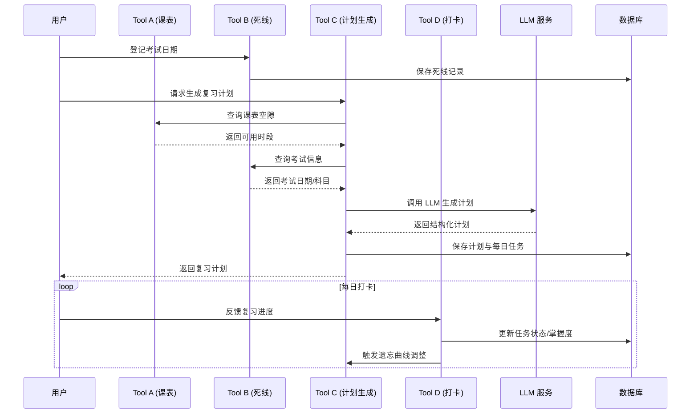

---

## 三、技术栈选择

### 3.1 前端技术栈

| 技术 | 版本 | 用途 |
|------|------|------|
| React | 18+ | Web 端框架 |
| TypeScript | 5+ | 类型安全 |
| Tailwind CSS | 3+ | 样式框架 |
| Vite | 6+ | 构建工具 |
| Taro | 3+ | 小程序跨端开发 |
| Lucide React | 最新 | 图标库 |

### 3.2 后端技术栈

| 技术 | 版本 | 用途 |
|------|------|------|
| Node.js | 20+ | 运行时 |
| NestJS | 10+ | 后端框架 |
| TypeScript | 5+ | 类型安全 |
| PostgreSQL | 16+ | 主数据库 |
| Redis | 7+ | 缓存、消息队列 |
| MinIO | 最新 | 对象存储 |
| Prisma | 5+ | ORM |

### 3.3 外部服务

| 服务 | 用途 | 说明 |
|------|------|------|
| LLM API | 复习计划生成 | 可配置，支持主流厂商 |
| 微信推送 | 小程序消息推送 | 服务号模板消息 |
| OCR 服务 | 课表截图识别 | 自研或第三方 |

---

## 四、模块划分与职责

### 4.1 模块清单

| 模块 | 职责 | 优先级 | 所属阶段 |
|------|------|--------|----------|
| user | 用户注册、登录、资料管理 | P0 | V1.0 |
| course | 课表查询、导入、OCR 解析 | P0 | V1.0 |
| deadline | 死线登记、倒计时、阶梯提醒 | P0 | V1.0 |
| plan | 复习计划生成、编排、任务管理 | P0 | V1.0 |
| checkin | 每日打卡、进度追踪、遗忘曲线 | P1 | V1.1 |
| review | 学情复盘、薄弱点分析 | P2 | V2.0 |
| push | 早报、晚报、阶梯推送 | P0 | V1.0 |
| llm | LLM 调用、提示词管理、结果解析 | P0 | V1.0 |

### 4.2 模块详细说明

#### 4.2.1 User Module（用户模块）

| 功能 | 说明 |
|------|------|
| 注册/登录 | 手机号 + 验证码 |
| 用户资料 | 昵称、学校、专业、年级 |
| 偏好设置 | 每日提醒时段、复习时长上限 |
| 数据管理 | 数据导出、一键删除 |

#### 4.2.2 Course Module（课表模块）

| 功能 | 说明 |
|------|------|
| OCR 导入 | 截图上传 → 解析 → 结构化存储 |
| 手动录入 | 表单逐条录入课程信息 |
| 课表查询 | 自然语言查询、按日期查询 |
| 冲突检测 | 与死线/计划的时间冲突检测 |

#### 4.2.3 Deadline Module（死线模块）

| 功能 | 说明 |
|------|------|
| 死线登记 | 作业/考试/其他类型 |
| 倒计时计算 | D-N 标记生成 |
| 阶梯提醒 | D-7/D-3/D-1/D-0 触发 |
| 状态管理 | 进行中/已完成/已过期 |

#### 4.2.4 Plan Module（计划模块）

| 功能 | 说明 |
|------|------|
| 计划生成 | LLM + 课表空隙 + 考试日期 |
| 计划编排 | 避开课表时段、时长约束 |
| 任务管理 | 每日任务增删改查 |
| 考前速记 | D-0 推送速记清单 |

#### 4.2.5 Checkin Module（打卡模块）

| 功能 | 说明 |
|------|------|
| 每日打卡 | 22:00 主动询问、用户反馈 |
| 进度更新 | 任务完成状态、薄弱点标记 |
| 遗忘曲线 | 1/2/4/7 天回顾调度 |
| 计划调整 | 根据进度动态调整后续计划 |

#### 4.2.6 Push Module（推送模块）

| 功能 | 说明 |
|------|------|
| 早报 | 8:00 课程 + 死线 + 任务 |
| 晚报 | 22:00 打卡 + 明日预告 |
| 阶梯提醒 | 按 D-N 节点推送 |
| 推送控制 | 静默时段设置、频率控制 |

#### 4.2.7 Dialog Module（对话模块）

| 功能 | 说明 |
|------|------|
| 意图识别 | 将自然语言映射到对应工具 |
| 工具编排 | 多工具串联执行（B→A→C） |
| 对话管理 | 上下文维护、会话状态管理 |
| 边界处理 | 非学业内容识别与柔性拒绝 |

---

## 五、对话管理层设计

### 5.1 设计目标

PRD 的核心体验是**自然语言对话 + 多工具编排**，而非传统 CRUD 操作。对话管理层负责：
- 将用户自然语言输入解析为系统可执行的意图
- 在一次对话中编排多个工具的调用顺序
- 维护对话上下文，支持多轮对话
- 处理边界情况，引导用户回到学业场景

### 5.2 意图识别

#### 5.2.1 意图类型

| 意图类型 | 触发关键词示例 | 路由工具 |
|---------|---------------|---------|
| course_query | 下节课、在哪上课、今天有几节课 | Tool A |
| deadline_create | 设个提醒、X号考高数、作业截止 | Tool B |
| plan_generate | 帮我复习、快炸了、生成计划 | Tool B → A → C |
| checkin_feedback | 今天看完了、有点吃力、打卡 | Tool D |
| review_start | 考完了、这次怎么样 | Tool E |
| aggregated_query | 近期任务、这周有啥 | Tool A + B |
| boundary | 食堂、天气、闲聊 | 边界拒答引导 |

#### 5.2.2 识别策略

采用 **LLM 辅助意图识别**方案：

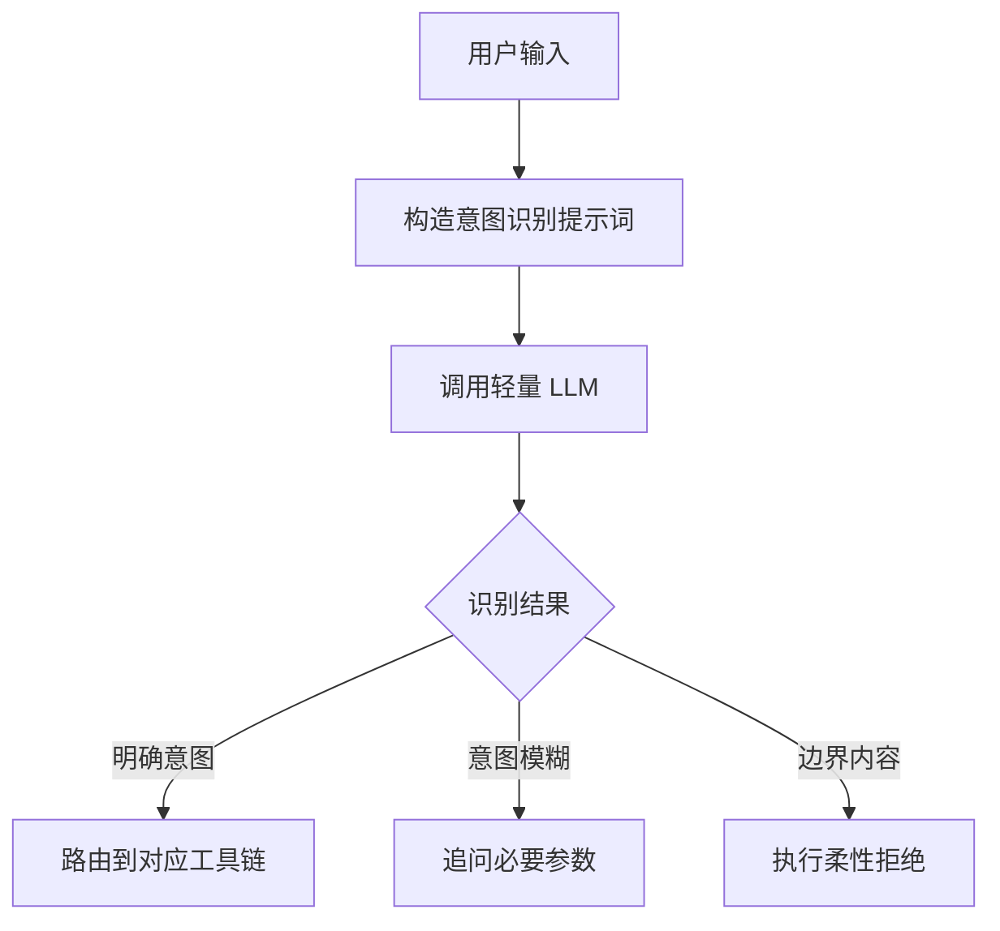

**意图识别提示词**：

```
你是一个意图分类器。请根据用户输入判断意图类型。

用户输入：{user_input}

意图类型选项：
1. course_query - 查询课表相关（下节课、在哪上课、今天有几节课）
2. deadline_create - 创建死线（设个提醒、X号考、作业截止）
3. plan_generate - 生成复习计划（帮我复习、快炸了、生成计划）
4. checkin_feedback - 进度反馈（今天看完了、有点吃力、打卡）
5. review_start - 复盘（考完了、这次怎么样）
6. aggregated_query - 聚合查询（近期任务、这周有啥）
7. boundary - 非学业内容（食堂、天气、闲聊）

请只返回意图类型代码，不要包含其他文字。
```

### 5.3 工具编排引擎

#### 5.3.1 编排规则

| 意图 | 工具调用链 | 说明 |
|------|-----------|------|
| course_query | A | 直接查询课表 |
| deadline_create | B | 直接创建死线 |
| plan_generate | B → A → C | 先登记死线→查询课表空隙→生成计划 |
| checkin_feedback | D → C | 提交打卡→调整计划 |
| aggregated_query | A + B | 并行查询课表和死线 |

#### 5.3.2 编排流程

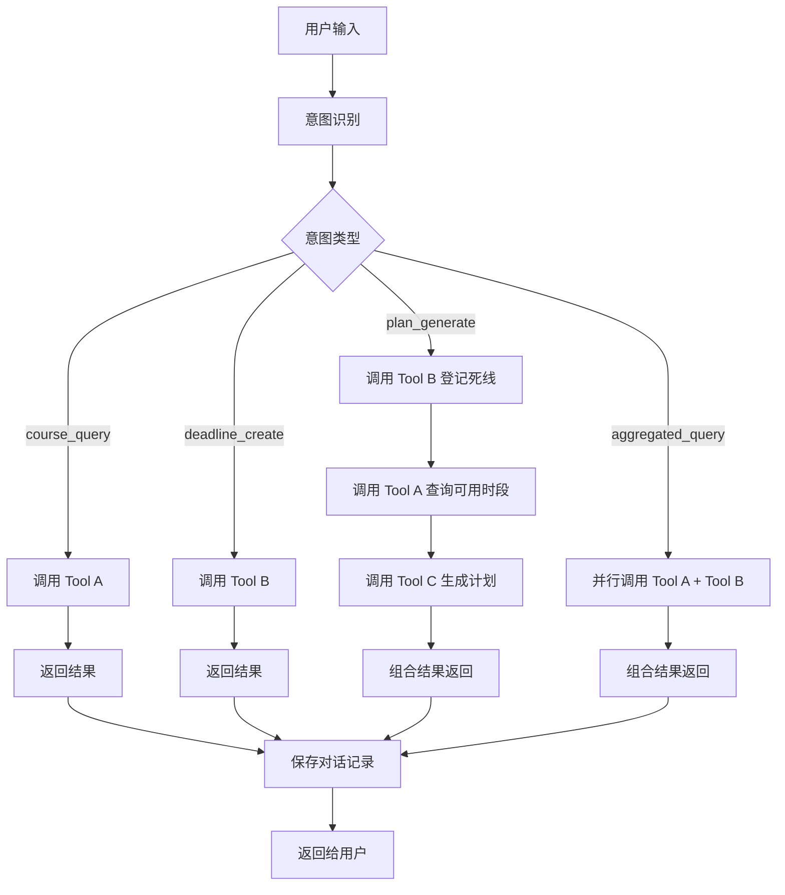

#### 5.3.3 编排执行器设计

**输入**：意图类型、用户输入、会话上下文

**输出**：统一响应（包含所有工具调用结果的组合）

**核心逻辑**：
1. 根据意图类型获取预设的工具调用链
2. 按顺序执行每个工具，将前一个工具的输出作为后一个工具的输入
3. 处理并行调用（如 aggregated_query）
4. 组合所有结果，生成自然语言回复

### 5.4 对话状态管理

#### 5.4.1 会话上下文结构

```typescript
interface SessionContext {
  session_id: string;
  user_id: string;
  current_intent: string;
  pending_params: string[];
  tool_results: Record<string, any>;
  last_active_at: Date;
  expires_at: Date;
}
```

#### 5.4.2 上下文生命周期

| 阶段 | 说明 | 时长 |
|------|------|------|
| 活跃 | 用户正在进行对话 | 30 分钟无操作后进入空闲 |
| 空闲 | 等待用户继续 | 24 小时后过期 |
| 过期 | 会话失效，需重新开始 | - |

#### 5.4.3 上下文存储策略

| 存储位置 | 用途 | 说明 |
|---------|------|------|
| Redis | 当前活跃会话上下文 | 快速读写，自动过期 |
| PostgreSQL | 历史对话记录 | 持久化存储，支持查询 |

### 5.5 边界处理机制

#### 5.5.1 处理流程

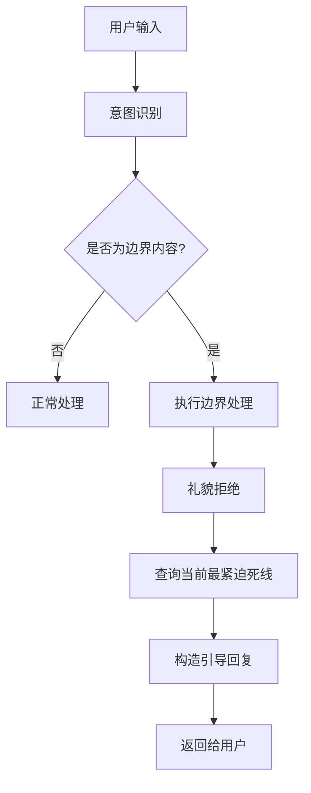

#### 5.5.2 边界回复模板

```
我只管帮你防挂科～对了，你{最紧迫死线描述}，现在还剩{剩余时间}。
```

**示例**：用户「今天学校食堂有啥好吃的？」→ 回复「我只管帮你防挂科～对了，你高数作业明晚 23:59 截止，现在还剩 32 小时。」

---

## 六、API 接口定义

### 6.1 接口约定

| 约定项 | 说明 |
|--------|------|
| 基础路径 | `/api/v1` |
| 请求格式 | JSON |
| 响应格式 | JSON |
| 统一响应结构 | `{ code, message, data }` |
| 认证方式 | JWT Bearer Token |
| 分页参数 | `page`（默认 1）、`size`（默认 20） |
| 幂等性 | POST 请求支持 `Idempotency-Key` 头 |

### 6.2 对话接口（核心入口）

| 方法 | 路径 | 功能 |
|------|------|------|
| POST | `/api/v1/dialog/message` | 发送消息（核心对话入口） |
| GET | `/api/v1/dialog/history` | 查询对话历史 |
| GET | `/api/v1/dialog/session` | 获取当前会话状态 |
| DELETE | `/api/v1/dialog/session` | 结束当前会话 |

**POST /api/v1/dialog/message**

请求头：
```
Idempotency-Key: uuid-v4-string (可选，用于幂等性)
```

请求体：
```json
{
  "message": "string",
  "session_id": "string (可选，首次对话可不传)",
  "attachment": {
    "type": "image|file",
    "data": "base64-string"
  }
}
```

响应体：
```json
{
  "code": 0,
  "message": "success",
  "data": {
    "session_id": "string",
    "reply": "string",
    "intent": "string",
    "actions": [
      {
        "tool": "course|deadline|plan|checkin|review",
        "action": "query|create|update|delete",
        "result": "string"
      }
    ],
    "next_steps": ["string"],
    "urgent_deadline": {
      "subject": "string",
      "deadline_time": "YYYY-MM-DD HH:mm:ss",
      "countdown": "string"
    }
  }
}
```

### 6.3 用户接口

| 方法 | 路径 | 功能 |
|------|------|------|
| POST | `/api/v1/users/register` | 用户注册 |
| POST | `/api/v1/users/login` | 用户登录 |
| GET | `/api/v1/users/profile` | 获取用户信息 |
| PUT | `/api/v1/users/profile` | 更新用户信息 |
| PUT | `/api/v1/users/preferences` | 更新偏好设置 |
| DELETE | `/api/v1/users/data` | 删除用户数据 |

**POST /api/v1/users/register**

请求体：
```json
{
  "phone": "string",
  "code": "string",
  "nickname": "string",
  "school": "string",
  "major": "string",
  "grade": "string"
}
```

响应体：
```json
{
  "code": 0,
  "message": "success",
  "data": {
    "user_id": "string",
    "token": "string"
  }
}
```

### 6.4 课表接口

| 方法 | 路径 | 功能 |
|------|------|------|
| POST | `/api/v1/courses/import` | OCR 导入课表 |
| POST | `/api/v1/courses` | 手动添加课程 |
| GET | `/api/v1/courses` | 查询课表列表 |
| GET | `/api/v1/courses/today` | 查询今日课程 |
| GET | `/api/v1/courses/next` | 查询下节课 |
| GET | `/api/v1/courses/week` | 查询本周课表 |
| PUT | `/api/v1/courses/:id` | 更新课程 |
| DELETE | `/api/v1/courses/:id` | 删除课程 |
| GET | `/api/v1/courses/available-slots` | 查询可用复习时段 |

**POST /api/v1/courses/import**

请求体（multipart/form-data）：
```
image: File (课表截图)
```

响应体：
```json
{
  "code": 0,
  "message": "success",
  "data": {
    "courses": [
      {
        "name": "string",
        "teacher": "string",
        "location": "string",
        "weekday": 1,
        "start_period": 1,
        "end_period": 2,
        "week_range": "string"
      }
    ],
    "imported_count": 5
  }
}
```

**GET /api/v1/courses/available-slots**

请求参数：
```json
{
  "start_date": "YYYY-MM-DD",
  "end_date": "YYYY-MM-DD"
}
```

响应体：
```json
{
  "code": 0,
  "message": "success",
  "data": {
    "slots": [
      {
        "date": "YYYY-MM-DD",
        "time_ranges": ["08:00-12:00", "14:00-18:00"]
      }
    ]
  }
}
```

### 6.5 死线接口

| 方法 | 路径 | 功能 |
|------|------|------|
| POST | `/api/v1/deadlines` | 创建死线 |
| GET | `/api/v1/deadlines` | 查询死线列表 |
| GET | `/api/v1/deadlines/urgent` | 查询紧迫死线 |
| PUT | `/api/v1/deadlines/:id` | 更新死线 |
| DELETE | `/api/v1/deadlines/:id` | 删除死线 |
| PUT | `/api/v1/deadlines/:id/complete` | 标记完成 |

**POST /api/v1/deadlines**

请求体：
```json
{
  "type": "homework|exam|other",
  "subject": "string",
  "course_id": "string (optional)",
  "deadline_time": "YYYY-MM-DD HH:mm:ss",
  "weight": 1,
  "description": "string (optional)"
}
```

响应体：
```json
{
  "code": 0,
  "message": "success",
  "data": {
    "ddl_id": "string",
    "type": "exam",
    "subject": "高数",
    "deadline_time": "2026-07-11 09:00:00",
    "countdown_days": 4,
    "status": "pending"
  }
}
```

### 6.6 计划接口

| 方法 | 路径 | 功能 |
|------|------|------|
| POST | `/api/v1/plans/generate` | 生成复习计划 |
| GET | `/api/v1/plans` | 查询计划列表 |
| GET | `/api/v1/plans/:id` | 查询计划详情 |
| PUT | `/api/v1/plans/:id` | 更新计划 |
| DELETE | `/api/v1/plans/:id` | 删除计划 |
| GET | `/api/v1/plans/:id/tasks` | 查询计划任务 |
| GET | `/api/v1/plans/today` | 查询今日任务 |

**POST /api/v1/plans/generate**

请求体：
```json
{
  "ddl_id": "string",
  "outline_image": "string (base64, optional)",
  "self_assessment": "string (optional)",
  "daily_hours_limit": 4
}
```

响应体：
```json
{
  "code": 0,
  "message": "success",
  "data": {
    "plan_id": "string",
    "subject": "高数",
    "exam_date": "2026-07-11",
    "tasks": [
      {
        "task_id": "string",
        "date": "2026-07-07",
        "knowledge_points": ["极限与连续"],
        "duration_minutes": 120,
        "time_slot": "19:00-21:00",
        "status": "pending"
      }
    ],
    "generated_at": "2026-07-07 10:00:00"
  }
}
```

### 6.7 打卡接口

| 方法 | 路径 | 功能 |
|------|------|------|
| POST | `/api/v1/checkins` | 提交打卡 |
| GET | `/api/v1/checkins/history` | 查询打卡历史 |
| GET | `/api/v1/checkins/today` | 查询今日打卡状态 |

**POST /api/v1/checkins**

请求体：
```json
{
  "plan_id": "string",
  "task_id": "string",
  "completion_status": "completed|partial|uncompleted",
  "feedback": "string",
  "weak_points": ["string"]
}
```

响应体：
```json
{
  "code": 0,
  "message": "success",
  "data": {
    "checkin_id": "string",
    "plan_id": "string",
    "task_id": "string",
    "completion_status": "completed",
    "updated_tasks": ["string"],
    "review_schedule": {
      "knowledge_point": "中值定理",
      "review_date": "2026-07-09"
    }
  }
}
```

### 6.8 推送接口

| 方法 | 路径 | 功能 |
|------|------|------|
| GET | `/api/v1/push/morning` | 获取今日早报 |
| GET | `/api/v1/push/evening` | 获取今日晚报 |
| PUT | `/api/v1/push/settings` | 更新推送设置 |

---

## 七、数据模型设计

### 7.1 ER 图

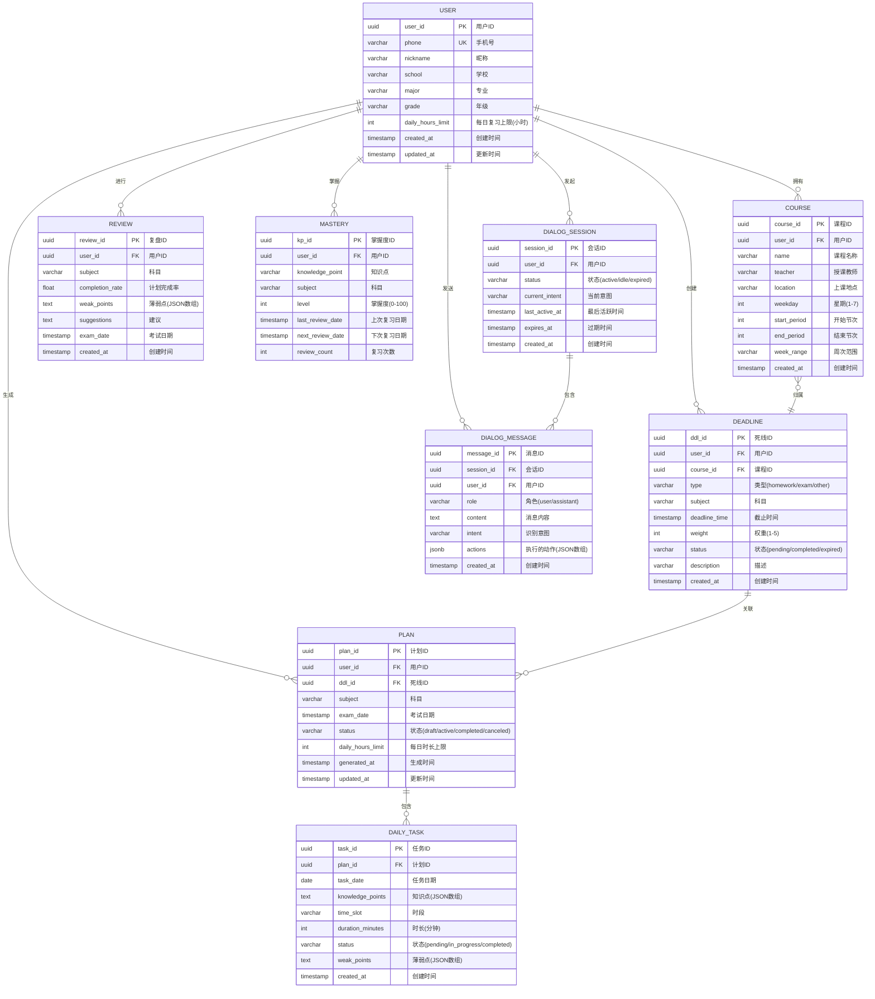

### 7.2 DDL 语句

```sql
CREATE TABLE users (
    user_id UUID PRIMARY KEY DEFAULT gen_random_uuid(),
    phone VARCHAR(20) UNIQUE NOT NULL,
    nickname VARCHAR(50) NOT NULL,
    school VARCHAR(100),
    major VARCHAR(100),
    grade VARCHAR(20),
    daily_hours_limit INT DEFAULT 4,
    created_at TIMESTAMP DEFAULT CURRENT_TIMESTAMP,
    updated_at TIMESTAMP DEFAULT CURRENT_TIMESTAMP
);

CREATE TABLE courses (
    course_id UUID PRIMARY KEY DEFAULT gen_random_uuid(),
    user_id UUID REFERENCES users(user_id) ON DELETE CASCADE,
    name VARCHAR(100) NOT NULL,
    teacher VARCHAR(50),
    location VARCHAR(100),
    weekday INT NOT NULL CHECK (weekday BETWEEN 1 AND 7),
    start_period INT NOT NULL,
    end_period INT NOT NULL,
    week_range VARCHAR(50),
    created_at TIMESTAMP DEFAULT CURRENT_TIMESTAMP
);

CREATE TABLE deadlines (
    ddl_id UUID PRIMARY KEY DEFAULT gen_random_uuid(),
    user_id UUID REFERENCES users(user_id) ON DELETE CASCADE,
    course_id UUID REFERENCES courses(course_id),
    type VARCHAR(20) NOT NULL CHECK (type IN ('homework', 'exam', 'other')),
    subject VARCHAR(50) NOT NULL,
    deadline_time TIMESTAMP NOT NULL,
    weight INT DEFAULT 1 CHECK (weight BETWEEN 1 AND 5),
    status VARCHAR(20) DEFAULT 'pending' CHECK (status IN ('pending', 'completed', 'expired')),
    description TEXT,
    created_at TIMESTAMP DEFAULT CURRENT_TIMESTAMP
);

CREATE TABLE plans (
    plan_id UUID PRIMARY KEY DEFAULT gen_random_uuid(),
    user_id UUID REFERENCES users(user_id) ON DELETE CASCADE,
    ddl_id UUID REFERENCES deadlines(ddl_id) ON DELETE CASCADE,
    subject VARCHAR(50) NOT NULL,
    exam_date TIMESTAMP NOT NULL,
    status VARCHAR(20) DEFAULT 'draft' CHECK (status IN ('draft', 'active', 'completed', 'canceled')),
    daily_hours_limit INT DEFAULT 4,
    generated_at TIMESTAMP DEFAULT CURRENT_TIMESTAMP,
    updated_at TIMESTAMP DEFAULT CURRENT_TIMESTAMP
);

CREATE TABLE daily_tasks (
    task_id UUID PRIMARY KEY DEFAULT gen_random_uuid(),
    plan_id UUID REFERENCES plans(plan_id) ON DELETE CASCADE,
    task_date DATE NOT NULL,
    knowledge_points JSONB NOT NULL,
    time_slot VARCHAR(20),
    duration_minutes INT NOT NULL,
    status VARCHAR(20) DEFAULT 'pending' CHECK (status IN ('pending', 'in_progress', 'completed')),
    weak_points JSONB DEFAULT '[]',
    created_at TIMESTAMP DEFAULT CURRENT_TIMESTAMP
);

CREATE TABLE masteries (
    kp_id UUID PRIMARY KEY DEFAULT gen_random_uuid(),
    user_id UUID REFERENCES users(user_id) ON DELETE CASCADE,
    knowledge_point VARCHAR(100) NOT NULL,
    subject VARCHAR(50) NOT NULL,
    level INT DEFAULT 0 CHECK (level BETWEEN 0 AND 100),
    last_review_date TIMESTAMP,
    next_review_date TIMESTAMP,
    review_count INT DEFAULT 0
);

CREATE TABLE reviews (
    review_id UUID PRIMARY KEY DEFAULT gen_random_uuid(),
    user_id UUID REFERENCES users(user_id) ON DELETE CASCADE,
    subject VARCHAR(50) NOT NULL,
    completion_rate FLOAT DEFAULT 0,
    weak_points JSONB DEFAULT '[]',
    suggestions TEXT,
    exam_date TIMESTAMP NOT NULL,
    created_at TIMESTAMP DEFAULT CURRENT_TIMESTAMP
);

CREATE TABLE dialog_sessions (
    session_id UUID PRIMARY KEY DEFAULT gen_random_uuid(),
    user_id UUID REFERENCES users(user_id) ON DELETE CASCADE,
    status VARCHAR(20) DEFAULT 'active' CHECK (status IN ('active', 'idle', 'expired')),
    current_intent VARCHAR(50),
    last_active_at TIMESTAMP DEFAULT CURRENT_TIMESTAMP,
    expires_at TIMESTAMP NOT NULL,
    created_at TIMESTAMP DEFAULT CURRENT_TIMESTAMP
);

CREATE TABLE dialog_messages (
    message_id UUID PRIMARY KEY DEFAULT gen_random_uuid(),
    session_id UUID REFERENCES dialog_sessions(session_id) ON DELETE CASCADE,
    user_id UUID REFERENCES users(user_id) ON DELETE CASCADE,
    role VARCHAR(20) NOT NULL CHECK (role IN ('user', 'assistant')),
    content TEXT NOT NULL,
    intent VARCHAR(50),
    actions JSONB DEFAULT '[]',
    created_at TIMESTAMP DEFAULT CURRENT_TIMESTAMP
);

CREATE INDEX idx_deadlines_user_id ON deadlines(user_id);
CREATE INDEX idx_deadlines_deadline_time ON deadlines(deadline_time);
CREATE INDEX idx_plans_user_id ON plans(user_id);
CREATE INDEX idx_plans_exam_date ON plans(exam_date);
CREATE INDEX idx_daily_tasks_plan_id ON daily_tasks(plan_id);
CREATE INDEX idx_daily_tasks_task_date ON daily_tasks(task_date);
CREATE INDEX idx_courses_user_id ON courses(user_id);
CREATE INDEX idx_dialog_sessions_user_id ON dialog_sessions(user_id);
CREATE INDEX idx_dialog_messages_session_id ON dialog_messages(session_id);
CREATE INDEX idx_dialog_messages_created_at ON dialog_messages(created_at);
```

---

## 八、核心业务逻辑

### 8.1 课表 OCR 解析流程

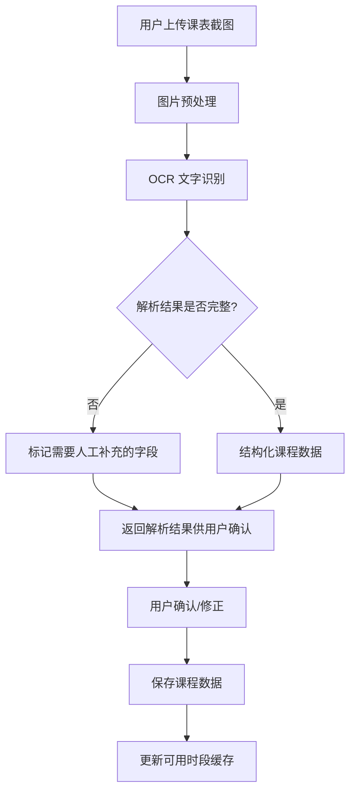

### 8.2 阶梯提醒规则

| 节点 | 触发条件 | 推送时间 | 模板内容 |
|------|---------|---------|---------|
| D-7 | 距离截止 7 天 | 当天 8:00 | 「还有一周，建议开始规划。」+ 建议生成复习计划 |
| D-3 | 距离截止 3 天 | 当天 8:00 | 「剩 3 天，今日复习任务已排好。」|
| D-1 | 距离截止 1 天 | 当天 20:00 | 「明天截止，今晚必须完成。」+ 精确剩余时间 |
| D-0 | 当天截止 | 当天 7:00 / 前 2h | 「今日截止！」+ 任务详情 |

**实现逻辑**：
- 定时任务每日 7:50 / 19:50 / 考试前 2h 扫描数据库
- 查询符合条件的死线记录
- 调用推送服务发送消息

### 8.3 复习计划编排算法

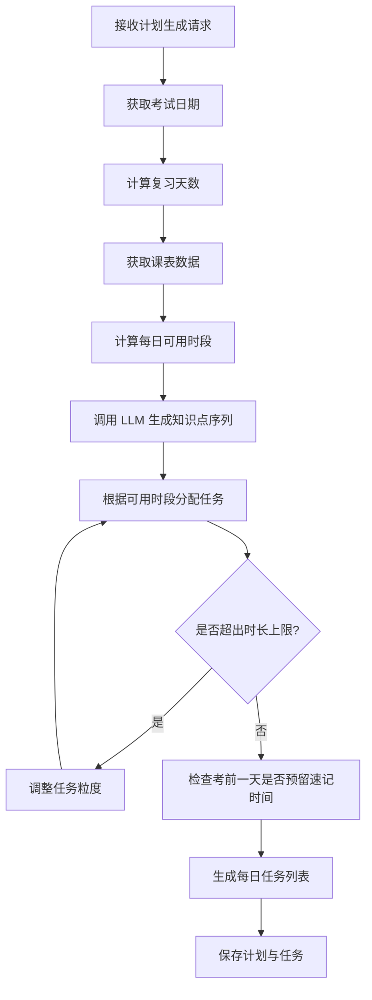

**约束条件**：
1. 必须避开课表上课时段
2. 每天总复习时长 ≤ 用户设定上限（默认 4 小时）
3. 薄弱知识点安排更高权重
4. D-0 仅安排速记 + 错题回顾，不安排新内容

### 8.4 艾宾浩斯遗忘曲线调度

| 回顾次序 | 距上次学习天数 | 触发时间 |
|---------|--------------|---------|
| 第 1 次 | 1 | 上次学习后 24h |
| 第 2 次 | 2 | 上次学习后 48h |
| 第 3 次 | 4 | 上次学习后 96h |
| 第 4 次 | 7 | 上次学习后 168h |

**实现逻辑**：
- 用户打卡时标记薄弱知识点
- 根据回顾次序计算下次回顾日期
- 将回顾任务插入到对应日期的计划中
- 达到回顾日期时推送提醒

### 8.5 早报/晚报生成逻辑

**早报（8:00）**：
1. 查询今日课程列表（按时间排序）
2. 查询今日截止的死线（含今日到期和未来 7 天内的）
3. 查询今日复习任务
4. 组合成早报内容

**晚报（22:00）**：
1. 查询今日打卡记录
2. 统计完成率
3. 查询明日课程和任务
4. 组合成晚报内容

---

## 九、LLM 集成方案

### 9.1 LLM 调用策略

| 场景 | 模型要求 | 超时时间 | 降级策略 |
|------|---------|---------|---------|
| 复习计划生成 | 强推理能力 | 10s | 返回规则兜底计划 |
| 知识点提取 | 中等推理 | 5s | 返回空列表 |
| 复盘分析 | 强推理能力 | 8s | 返回基础统计 |

### 8.2 提示词模板

**复习计划生成提示词**：

```
你是一个专业的学业规划助手。请根据以下信息为用户生成结构化的复习计划：

【考试信息】
科目：{subject}
考试日期：{exam_date}
距离考试天数：{days_left}

【可用复习时段】
{available_slots}

【考试大纲/教材目录】
{outline}

【用户自评】
{self_assessment}

【约束条件】
1. 计划必须避开课表上课时段
2. 每天总复习时长不超过 {daily_hours_limit} 小时
3. 薄弱知识点安排更高权重和回顾节点
4. 考前一天(D-0)仅安排"速记+错题回顾"，不安排新内容
5. 计划以"天"为粒度，每天包含：日期、知识点、预计时长、对应时段

请以 JSON 格式返回，不要包含其他文字：
{
  "plan_name": "string",
  "tasks": [
    {
      "day_offset": -4,
      "date": "YYYY-MM-DD",
      "knowledge_points": ["知识点1", "知识点2"],
      "duration_minutes": 120,
      "suggested_time": "19:00-21:00",
      "notes": "string"
    }
  ],
  "weak_points": ["需要重点关注的知识点"],
  "preview_content": "D-0 速记清单内容"
}
```

### 9.2 提示词模板

**复习计划生成提示词**：

```
你是一个专业的学业规划助手。请根据以下信息为用户生成结构化的复习计划：

【考试信息】
科目：{subject}
考试日期：{exam_date}
距离考试天数：{days_left}

【可用复习时段】
{available_slots}

【考试大纲/教材目录】
{outline}

【用户自评】
{self_assessment}

【约束条件】
1. 计划必须避开课表上课时段
2. 每天总复习时长不超过 {daily_hours_limit} 小时
3. 薄弱知识点安排更高权重和回顾节点
4. 考前一天(D-0)仅安排"速记+错题回顾"，不安排新内容
5. 计划以"天"为粒度，每天包含：日期、知识点、预计时长、对应时段

请以 JSON 格式返回，不要包含其他文字：
{
  "plan_name": "string",
  "tasks": [
    {
      "day_offset": -4,
      "date": "YYYY-MM-DD",
      "knowledge_points": ["知识点1", "知识点2"],
      "duration_minutes": 120,
      "suggested_time": "19:00-21:00",
      "notes": "string"
    }
  ],
  "weak_points": ["需要重点关注的知识点"],
  "preview_content": "D-0 速记清单内容"
}
```

### 9.3 数据脱敏策略

| 敏感数据 | 处理方式 |
|---------|---------|
| 用户姓名 | 不传入 LLM |
| 手机号 | 不传入 LLM |
| 学校专业 | 可传入（非身份识别信息） |
| 课表信息 | 仅传入时段信息，不包含具体地点 |

### 9.4 幂等性设计

为防止 LLM 调用重复执行导致数据不一致，采用以下幂等性策略：

#### 9.4.1 幂等性 Key

客户端在发送请求时可携带 `Idempotency-Key` 请求头（UUID v4 格式）。

#### 9.4.2 处理流程

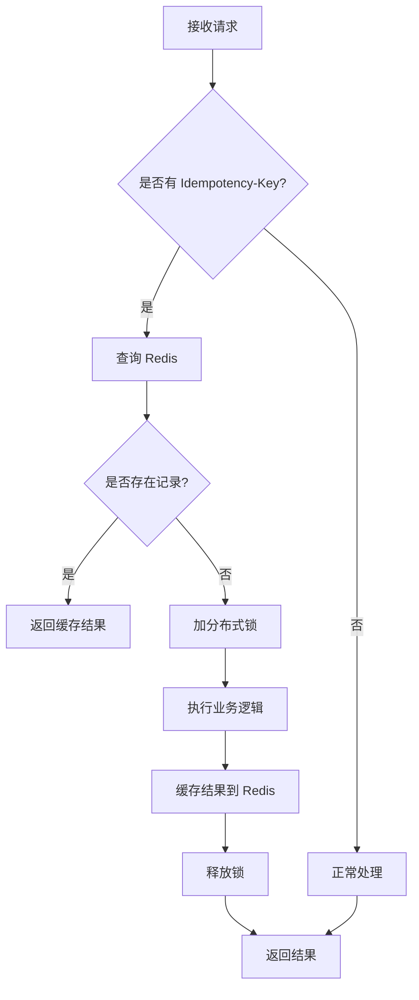

#### 9.4.3 缓存策略

| 缓存项 | 过期时间 | 说明 |
|--------|---------|------|
| 计划生成结果 | 24h | 防止重复生成相同计划 |
| 死线创建 | 7天 | 防止重复创建相同死线 |
| LLM 调用结果 | 1h | 防止重复调用 LLM |

---

## 十、定时任务与推送机制

### 10.1 定时任务架构

采用 **Redis 延迟队列 + Cron 定时任务** 组合方案，确保推送准时误差 < 1min。

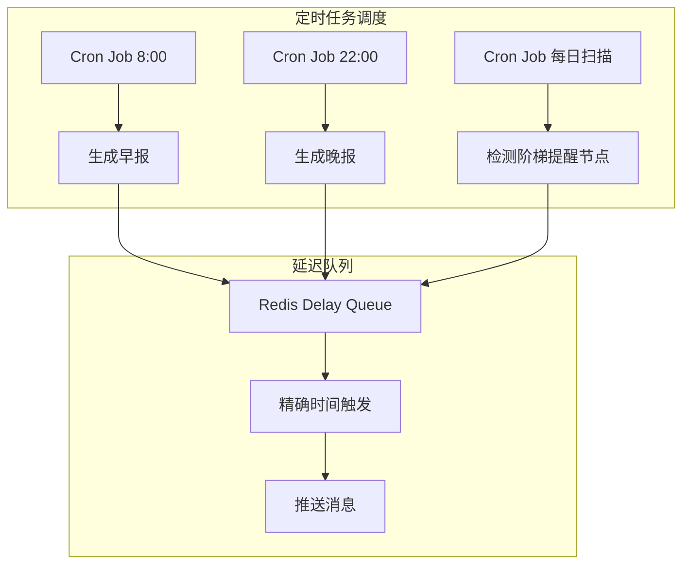

### 10.2 实现机制

#### 10.2.1 阶梯提醒触发流程

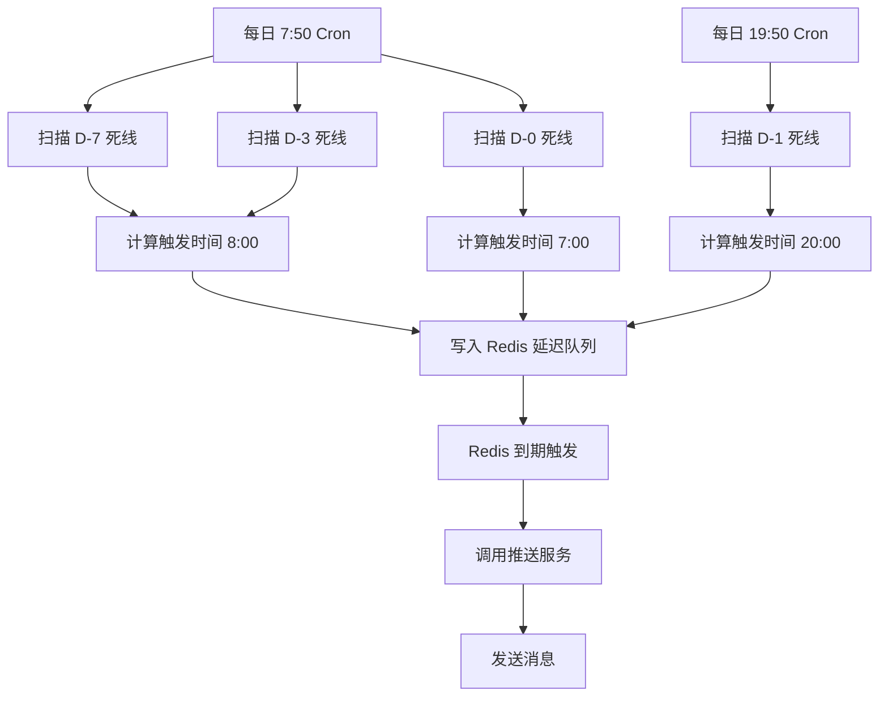

#### 10.2.2 时间精度保障

| 措施 | 说明 |
|------|------|
| Redis 延迟队列 | 使用 `ZRANGEBYSCORE` 精确到秒级触发 |
| 定时扫描补偿 | Cron 每分钟扫描一次，处理漏触发情况 |
| 分布式锁 | 防止多个实例重复推送 |
| 时间同步 | 所有服务器使用 NTP 同步时间 |

#### 10.2.3 推送频率控制

| 用户设置 | 默认值 | 说明 |
|---------|--------|------|
| 静默时段 | 23:00 - 07:00 | 此期间不推送非紧急消息 |
| 每日最大推送数 | 10 | 防止打扰用户 |
| 可关闭推送 | 是 | 用户可完全关闭推送 |

### 10.3 推送内容生成

#### 10.3.1 早报生成

```typescript
interface MorningReport {
  courses: Array<{
    name: string;
    location: string;
    time: string;
  }>;
  deadlines: Array<{
    subject: string;
    type: string;
    countdown: string;
  }>;
  tasks: Array<{
    knowledge_points: string[];
    time_slot: string;
    duration: string;
  }>;
}
```

#### 10.3.2 晚报生成

```typescript
interface EveningReport {
  completion_rate: number;
  completed_tasks: string[];
  pending_tasks: string[];
  tomorrow_courses: string[];
  tomorrow_deadlines: string[];
}
```

---

## 十一、部署与运维

### 11.1 部署架构

| 环境 | 配置 | 用途 |
|------|------|------|
| 开发环境 | 单机 Docker | 本地开发测试 |
| 测试环境 | 容器化集群 | 集成测试、UAT |
| 生产环境 | Kubernetes 集群 | 线上服务 |

### 11.2 配置管理

| 配置项 | 说明 | 管理方式 |
|--------|------|---------|
| 数据库连接 | PostgreSQL 连接字符串 | 环境变量 |
| Redis 配置 | Redis 连接信息 | 环境变量 |
| LLM API Key | 大模型调用密钥 | 密钥管理服务 |
| 推送配置 | 推送服务商配置 | 环境变量 |
| 端口配置 | 服务端口 | 环境变量 |

### 11.3 监控告警

| 监控项 | 阈值 | 告警方式 |
|--------|------|---------|
| API 响应时间 | > 3s | 钉钉/企微 |
| LLM 调用失败率 | > 5% | 钉钉/企微 |
| 数据库连接数 | > 90% | 钉钉/企微 |
| 服务可用性 | < 99% | 钉钉/企微 |

### 11.4 日志管理

| 日志级别 | 内容 |
|---------|------|
| DEBUG | 详细调试信息 |
| INFO | 正常业务流程 |
| WARN | 警告信息 |
| ERROR | 错误信息 |
| FATAL | 致命错误 |

日志存储：ELK Stack / Loki

---

## 十二、测试策略

### 12.1 测试分层

| 层级 | 测试内容 | 工具 |
|------|---------|------|
| 单元测试 | 单个函数/模块 | Jest |
| 集成测试 | 模块间交互 | Jest + Supertest |
| E2E 测试 | 完整业务流程 | Playwright |
| 性能测试 | 响应时间、并发 | Artillery |

### 12.2 核心场景测试用例

#### 12.2.1 课表查询

| 用例编号 | 测试场景 | 预期结果 |
|---------|---------|---------|
| TC-001 | 课表未导入时查询 | 返回引导录入提示 |
| TC-002 | 查询今日课程 | 返回今日所有课程，按时间排序 |
| TC-003 | 查询下节课 | 返回最近一节课程 |
| TC-004 | OCR 导入完整课表 | 正确解析所有课程信息 |

#### 12.2.2 死线提醒

| 用例编号 | 测试场景 | 预期结果 |
|---------|---------|---------|
| TC-005 | 登记考试后 D-7 | 当天 8:00 收到温和提示 |
| TC-006 | D-3 提醒 | 当天 8:00 收到中度提醒 |
| TC-007 | D-1 提醒 | 当天 20:00 收到强提醒 |
| TC-008 | D-0 提醒 | 当天 7:00 和前 2h 收到最高强度提醒 |

#### 12.2.3 计划生成与编排

| 用例编号 | 测试场景 | 预期结果 |
|---------|---------|---------|
| TC-009 | 生成计划避开课表时段 | 计划时段与课表无冲突 |
| TC-010 | 每日时长不超过上限 | 每天任务时长总和 ≤ 设定值 |
| TC-011 | D-0 仅安排速记 | 考前一天无新内容安排 |
| TC-012 | LLM 服务不可用 | 返回规则兜底计划 |

#### 12.2.4 边界处理

| 用例编号 | 测试场景 | 预期结果 |
|---------|---------|---------|
| TC-013 | 非学业提问 | 礼貌拒绝并引导回学业 |
| TC-014 | 指令模糊 | 仅追问必要信息（科目/时间） |
| TC-015 | 无权限访问他人数据 | 返回 403 错误 |

#### 12.2.5 对话管理层测试

| 用例编号 | 测试场景 | 预期结果 |
|---------|---------|---------|
| TC-016 | 自然语言意图识别 | 正确识别意图并路由到对应工具 |
| TC-017 | 多工具编排（生成计划） | 一次对话完成 B→A→C 调用链 |
| TC-018 | 对话上下文维护 | 多轮对话中保持上下文连贯 |
| TC-019 | 会话超时 | 30 分钟无操作后会话进入空闲状态 |

#### 12.2.6 幂等性测试

| 用例编号 | 测试场景 | 预期结果 |
|---------|---------|---------|
| TC-020 | 相同幂等性 Key 重复请求 | 返回相同结果，不重复执行 |
| TC-021 | 不同幂等性 Key 请求 | 正常执行，不互相影响 |

#### 12.2.7 定时任务测试

| 用例编号 | 测试场景 | 预期结果 |
|---------|---------|---------|
| TC-022 | 早报推送准时性 | 8:00 ± 1min 内发送 |
| TC-023 | 晚报推送准时性 | 22:00 ± 1min 内发送 |
| TC-024 | 阶梯提醒触发 | D-7/D-3/D-1/D-0 节点准时推送 |

---

*— 文档结束 —*